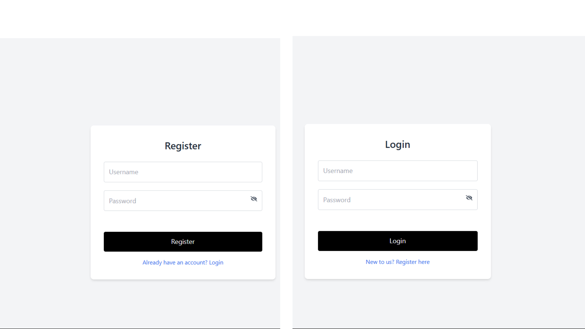
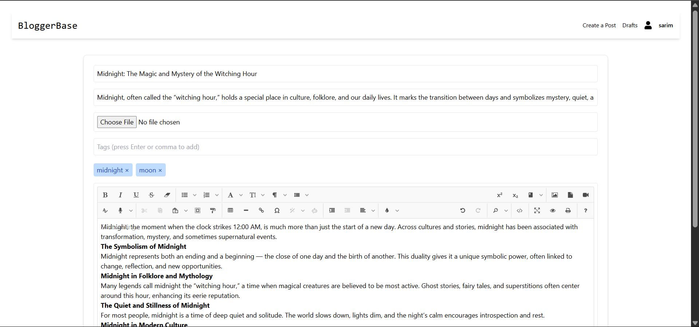
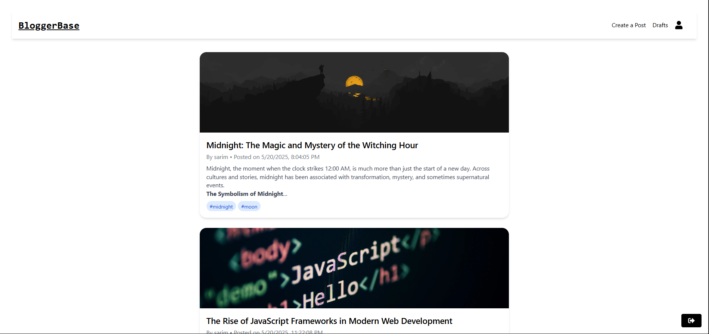
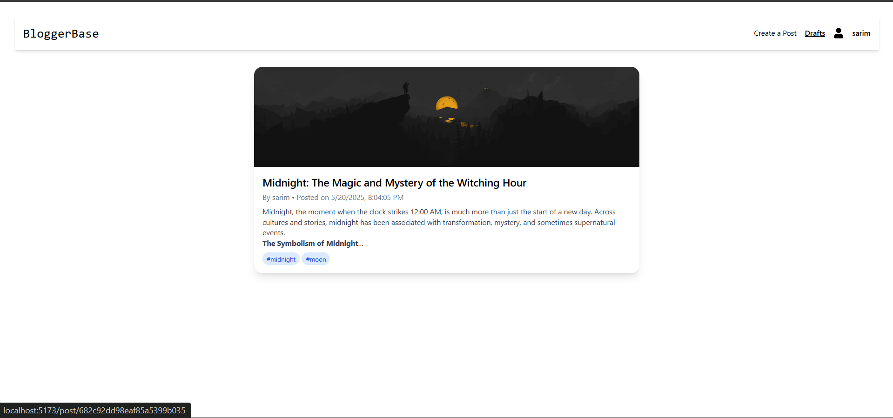

# 📝 Blog Platform (React + Express + Redis + MongoDB)

This project is a full-stack blogging platform that includes autosaving with Redis, secure JWT-based authentication, drafts, and support for editing published posts. Built with Vite + React on the frontend and Express.js on the backend.

## 🔋 Features

- ⚡ React + Vite frontend with JoditEditor for rich text editing
- 🔐 Secure JWT Authentication (stored in HTTP-only cookies)
- 💾 Autosaving using Redis (5s idle or 45s interval)
- 📝 Draft system to resume unfinished posts
- ✏️ Edit already published posts
- 📦 MongoDB for persistent post storage
- 🔁 Redis for temporary autosave caching
- 🔄 REST API with full CRUD for blog posts

---

## 🧩 Tech Stack

| Layer       | Technology                     |
|-------------|---------------------------------|
| Frontend    | Vite, React, Axios, JoditEditor |
| Backend     | Node.js, Express.js             |
| Database    | MongoDB                         |
| Caching     | Redis                           |
| Auth        | JWT (via HTTP-only cookies)     |

---

## 📁 Project Structure

```
.
├── frontend/                 # React + Vite frontend
│   └── src/
├── backend/                 # Express backend
│   ├── index.js
│   ├── uploads/
│   ├── models/             # MongoDB schemas
│   └── RedisClient.js       # Redis client setup
└── README.md
```

---

## 🚀 Getting Started

### 1. Clone the Repository

```bash
git clone https://github.com/your-username/blog-platform.git
cd blog-platform
```

---

### 2. Backend Setup (`server/`)

```bash
cd server
npm install
```

#### Create `.env` file

```env
PORT=3000
MONGO_URI=your_mongodb_connection_string
JWT_SECRET=your_jwt_secret
REDIS_URL=redis://localhost:6379
CLIENT_URL=http://localhost:5173
```

#### Start the server

```bash
npm run dev
```

---

### 3. Frontend Setup (`client/`)

```bash
cd client
npm install
npm run dev
```

> React app runs on `http://localhost:5173`

---

## 🔐 Authentication with JWT

- JWT tokens are issued upon login and stored as HTTP-only cookies.
- Tokens are automatically sent with every request using Axios.

```js
axios.post('http://localhost:3000/autoSave', postData, {
  withCredentials: true
});
```

---

## 💾 Autosaving via Redis

- Triggers on:
  - 5 seconds of typing inactivity
  - Every 45 seconds regardless
- Only active when the post is unsaved (not in draft/published state)

### Redis Key Format

```bash
autosave:<userId>
```

### Example Redis commands

```bash
redis-cli
keys *
get autosave:123
```

---

## 🧪 API Overview

### Auth Routes

| Method | Endpoint      | Description              |
|--------|---------------|--------------------------|
| POST   | `/login`      | Log in and receive token |
| POST   | `/register`   | Create a new user        |
| GET    | `/me`         | Get current user         |

### Post Routes

| Method | Endpoint                        | Description                         |
|--------|----------------------------------|-------------------------------------|
| POST   | `/posts`                        | Create post                         |
| PUT    | `/posts/:id`                   | Edit draft/published post           |
| GET    | `/posts/:id`                   | Fetch single post                   |
| GET    | `/posts?status=draft`          | Get all draft posts                 |
| GET    | `/posts?status=published`      | Get all published posts             |

### Autosave Routes

| Method | Endpoint             | Description                         |
|--------|----------------------|-------------------------------------|
| POST   | `/autoSave`          | Save to Redis                       |
| GET    | `/autoSave/:userId`  | Load autosaved post                 |
| DELETE | `/autoSave/:userId`  | Clear autosaved content             |

---

## 🔧 Redis Setup

Make sure Redis is installed and running.

### On macOS:

```bash
brew install redis
brew services start redis
```

### On Ubuntu:

```bash
sudo apt update
sudo apt install redis
sudo systemctl start redis
```

### On Windows (using WSL or Redis binaries):

```bash
redis-server
```

---

## 🔧 CORS and Cookie Config (Express)

```js
const cors = require("cors");

app.use(cors({
  origin: process.env.CLIENT_URL,
  credentials: true
}));
```

---

## 📦 MongoDB Post Schema (Example)

```js
{
  _id,
  userId,
  title,
  content,
  status: "draft" | "published",
  createdAt,
  updatedAt
}
```

---
# Screenshots
## Authentication

## Blog Editor

## Published Blogs 

## Drafts

## View Post

---

## 🧠 Redis Key Usage

```bash
autosave:<userId>
```

> Used to store in-progress post content per user.

---

## ✅ Workflow Summary

1. User logs in via `/login` (JWT token issued in cookie)
2. Starts a new post or resumes a draft
3. Autosave kicks in every 5s idle or 45s interval
4. On draft/save:
   - MongoDB stores the post
   - Redis autosave key is cleared
5. User can edit drafts or published posts

---

## ✨ Development Tips

- Use Postman to test endpoints
- Use `redis-cli` to check autosave entries
- Add middleware to validate JWT in protected routes

---

## 🛠️ Linting and Formatting

Install:

```bash
npm install -D eslint prettier eslint-config-prettier eslint-plugin-react
```

---

## 📬 Contact

For issues or feature requests, contact:

- **GitHub Issues:** [Open a ticket](https://github.com/your-username/blog-platform/issues)
- **Email:** your-email@example.com

---

Let me know if you'd like to add:

- Docker Support
- Vercel/Render deployment
- Screenshots or GIF demo

